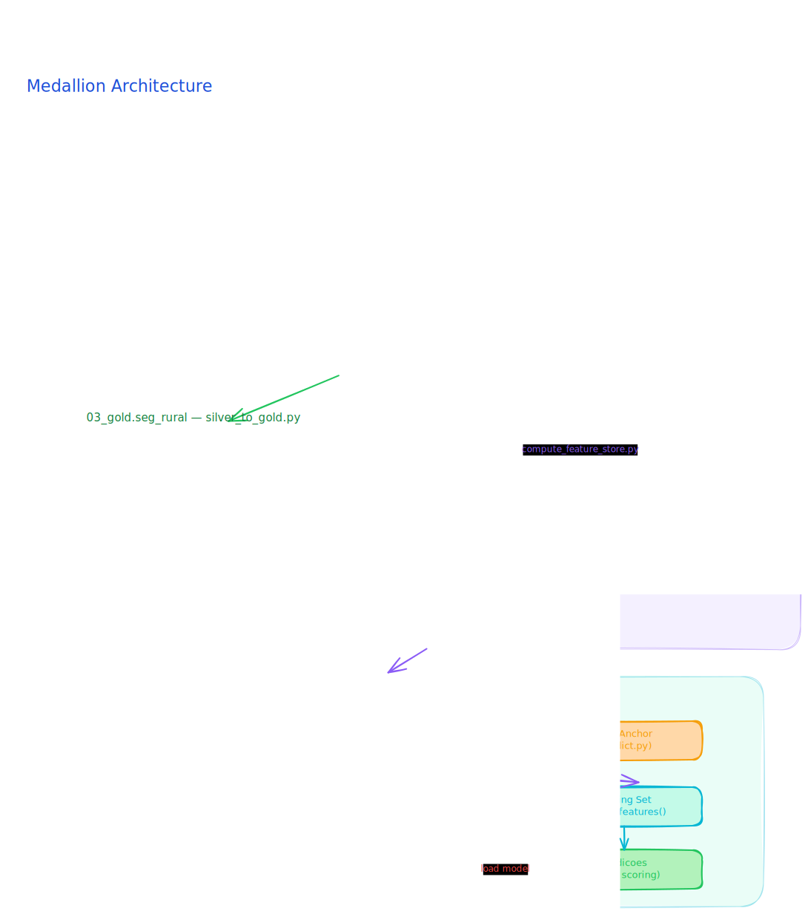
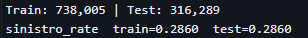
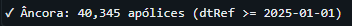
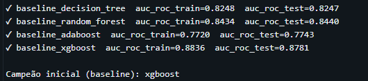
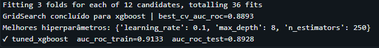
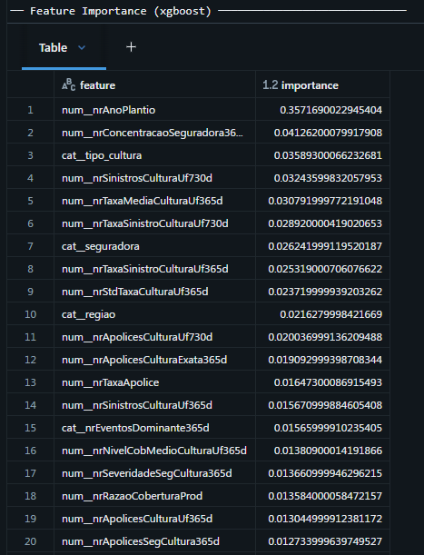
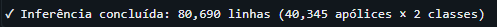
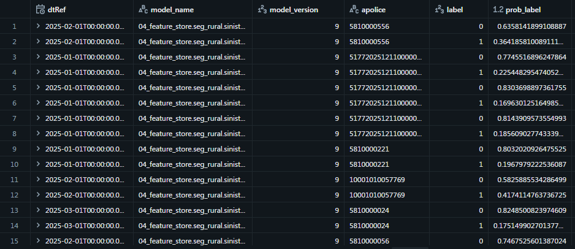

# ic-ml-model
Modelo de ML para predição de sinistro no Seguro Rural brasileiro.

## Índice
- [Explicação](#explicação)
- [Motivação](#motivação)
- [Fluxograma do Projeto](#fluxograma-do-projeto)
- [1. Processo de Ingestão](#1-processo-de-ingestão)
- [2. Arquitetura Medalhão](#2-arquitetura-medalhão)
- [3. Orquestração dos Pipelines](#3-orquestração-dos-pipelines)
- [4. Criação e Detalhamento da Feature Store](#4-criação-e-detalhamento-da-feature-store)
- [5. Features inputadas no modelo](#5-todas-as-features-inputadas-no-modelo)
- [6. train.py e predict.py](#6-trainpy-e-predictpy)
- [7. Resultados](#7-resultados)
- [Melhores práticas e Observabilidade](#melhores-práticas-de-engenharia-aplicadas-no-projeto)
- [Como executar no Databricks Free Edition](#como-executar-no-databricks-free-edition)
- [Dicionário de Dados](#dicionário-de-dados)

## Explicação

Este projeto implementa uma solução ponta a ponta para predição de sinistro no Seguro
Rural brasileiro, com base em dados do MAPA/PSR e execução em Databricks.

O objetivo é construir um classificador binário (`flSinistro`) com rastreabilidade completa
desde a ingestão do dado bruto até a geração de score em produção.

Princípios centrais da solução:
- arquitetura medalhão (Raw → Bronze → Silver → Gold);
- features point-in-time via Feature Store;
- prevenção de leakage por separação explícita entre features e labels;
- padronização de treino e inferência com o mesmo pipeline de pré-processamento.

## Motivação

O Seguro Rural apresenta alta variabilidade por região, cultura, clima e perfil financeiro
da apólice. Um modelo preditivo de sinistro ajuda a:
- apoiar análise de risco com base em evidências históricas;
- reduzir assimetria de informação na decisão de subscrição;
- priorizar monitoramento de carteiras com maior propensão a perdas;
- fornecer base técnica para melhorias contínuas em políticas de seguro e subvenção.

### Fluxograma do Projeto

## 1. Processo de Ingestão

A ingestão é dividida em duas partes:

### Download da base pública
- Arquivo: `src/ingestion/ingestion.py`
- Fontes:
	- `dados_abertos_psr_2016a2024.xlsx`
	- `dados_abertos_psr_2025.xlsx`
- Destino:
	- `/Volumes/00_raw/data/seguro_rural`

### Carga Raw → Bronze
- Arquivo: `src/pipeline/raw_to_bronze.py`
- Execução parametrizada por widgets (`table`, `tableName`)
- Tabelas resultantes:
	- `01_bronze.seg_rural.historical_seg`
	- `01_bronze.seg_rural.seg_2025`

## 2. Arquitetura Medalhão

O projeto é organizado por camadas e responsabilidades:
- `00_raw`: arquivos `.xlsx` brutos no Volume Databricks;
- `01_bronze.seg_rural.*`: ingestão sem transformação de negócio;
- `02_silver.seg_rural.seg_cleaned`: limpeza, renomeação canônica e colunas derivadas;
- `03_gold.seg_rural.*`: separação de features e labels sem leakage;
- `04_feature_store.seg_rural.*`: tabelas agregadas point-in-time para enriquecimento.

### Transformações na Silver

Arquivo principal: `src/pipeline/bronze_to_silver.py`.

Etapas relevantes:
- consolidação de histórico + ano corrente;
- tratamento de tipos, nulos e strings;
- normalização de dicionários de negócio (`tipo`, `evento`, `tipo_cultura`);
- criação de variáveis derivadas (`duracao`, `sinistro`, `sinistralidade`, `regiao`);
- remoção de colunas sensíveis e metadados não necessários.

### Publicação na Gold

Arquivo principal: `src/pipeline/silver_to_gold.py`.

Saídas:
- `03_gold.seg_rural.fs_seguro_features` (preditores)
- `03_gold.seg_rural.fs_seguro_labels` (respostas e colunas de referência)

Há validação anti-leakage para impedir colunas de desfecho no conjunto de features.

Módulos principais no repositório:
- `src/ingestion`: download e preparação dos arquivos de entrada;
- `src/pipeline`: transformação Raw → Bronze → Silver → Gold;
- `src/feature_store`: SQLs de agregação e publicação no Feature Store;
- `src/model_sinistro`: pré-processamento, treino e predição;
- `src/lib/const.py`: fonte única de constantes, tabelas e listas de colunas.

## 3. Orquestração dos Pipelines

O projeto usa Databricks Asset Bundles (DAB) em `src/jobs/`.

### Job `seg_bronze_ingestion`
- task `historical_seg`
- task `seg_2025` (dependente de `historical_seg`)

Objetivo: garantir ingestão sequencial dos dois arquivos fonte na Bronze.

### Job `seg_silver_to_gold`
- task `silver_to_gold`
- tasks dependentes para materialização de Feature Store:
	- `fs_historico_municipio`
	- `fs_risco_cultura_uf`
	- `fs_apolice_financeiro`
	- `fs_risco_seguradora_cultura`
	- `fs_anomalia_taxa`
	- `fs_concentracao_carteira`

Objetivo: consolidar Silver/Gold antes de materializar todas as tabelas de features.

## 4. Criação e Detalhamento da Feature Store

A criação é centralizada em `src/feature_store/compute_feature_store.py`.

O notebook recebe o parâmetro `feature` e resolve:
- SQL (`src/feature_store/fs_*.sql`)
- tabela de destino (`FEATURE_MAP`)
- chave primária (`PRIMARY_KEYS`)

Escrita feita com `mode='merge'`, mantendo execução idempotente e incremental. Sempre prestando atenção à semântica *point-in-time* (evitando *data leakage* limitando agregações apenas a apólices *encerradas* antes da data focada).

### Conhecendo as Features Calculadas

A Feature Store provê visões agregadas fundamentais para avaliar risco sem vazamento de dados do futuro. As tabelas disponíveis são:

#### 1. Risco Histórico por Município (`fs_historico_municipio`)
- **Chave de Entidade:** Município (`mun`)
- **O que calculamos?** Densidade de contratação de apólices e o histórico de risco (contagem e volumetria do índice de sinistralidade e severidade) em janelas móveis de 90 a 1095 dias.
- **Por que importa?** Alta densidade de novas contrações recentes num município pode indicar *seleção adversa* (ex: o produtor pressente um evento climático e corre para fechar seguro). O histórico revela a regularidade de ocorrências e a severidade dos eventos naquele local específo ao longo do tempo.

#### 2. Engenharia Financeira da Apólice (`fs_apolice_financeiro`)
- **Chave de Entidade:** Número da Apólice (`apolice`)
- **O que calculamos?** 
  - *Métricas temporais*: quadrimestre, ano de plantio, duração normalizada.
  - *Métricas de densidade*: Limite de garantia por hectare (patrimônio em risco), Prêmio por hectare.
  - *Razões financeiras*: Taxa aplicada, razão de cobertura produtiva, proporção de subvenção, nível de cobertura.
- **Por que importa?** Diferenciar culturas curtas de culturas arbóreas, evidenciar o apetite ao risco (ou risco moral) pela escolha entre o *nível de cobertura* e quão sensível é o patrimônio alocado *por hectare*.

#### 3. Risco Base por Cultura e UF (`fs_risco_cultura_uf`)
- **Chave de Entidade:** UF e Categoria de Cultura (`uf`, `tipo_cultura`)
- **O que calculamos?** Total de apólices, proporção de sinistros (taxa de sinistro), e severidade para uma cultura em um Estado (janela de 365 dias).
- **Por que importa?** Fornece uma "linha de base" (um preenchedor de hierarquia mais macro) caso um deteminado município não possua histórico considerável para um tipo específico de cultura, permitindo melhor estimação do risco latente. 

#### 4. Comportamento Histórico por Seguradora e Cultura (`fs_risco_seguradora_cultura`)
- **Chave de Entidade:** Seguradora e Categoria de Cultura (`seguradora`, `tipo_cultura`)
- **O que calculamos?** Volume de exposições de uma seguradora face a uma cultura, percentual da taxa de sinistro e severidade dos eventos sob seu domínio. 
- **Por que importa?** Permite identificar padrões de *pricing* diferenciado. Revela se a seguradora possui *expertise* na gestão e vistoria de determinada cultura e se sofreu alta seleção adversa naquele segmento no ano que passou.

#### 5. Parâmetros de Referência de Taxa (`fs_anomalia_taxa`)
- **Chave de Entidade:** UF e Cultura Global (`uf`, `cultura`)
- **O que calculamos?** Taxa média praticada e desvio padrão. 
- **Por que importa?** Essa referência constrói a base para detectar *anomalia de precificação*. A "anomalia" final surge no join durante o treino (taxa_apólice em relação à média praticada no Estado). Desvios altíssimos indicam precificação volátil e risco muito acentuado.

#### 6. Concentração de Carteira Regional (`fs_concentracao_carteira`)
- **Chave de Entidade:** Seguradora e Município (`seguradora`, `mun`)
- **O que calculamos?** O peso de um município na exposição total de uma seguradora (percentual de limite de garantia), bem como o cômputo do HHI (Índice *Herfindahl-Hirschman*).
- **Por que importa?** Altíssimas concentrações (HHI próximo a 1, ou peso enorme em apenas alguns municípios) denotam forte exposição a eventos regionais agudos (ex: uma seca regional). Empresas com risco macro bem distribuído absorvem o choque climático mais naturalmente sem comprometer pagamentos de indenização.

## 5. Todas as features inputadas no modelo

O detalhamento e explicação preditiva (breakdown) de todas as variáveis de entrada usadas na modelagem do risco (históricas, de apólice, categóricas e cíclicas) foram movidos para a documentação específica:

- **[Dicionário de Features do Modelo](docs/features_modelo.md)**

Observação rápida: as chaves `mun`, `uf`, `cultura`, `apolice` e `dtRef` são utilizadas internamente em processos de *Feature Lookup* e rastreio, não entrando matematicamente como entradas numéricas no classificador final.

## 6. train.py e predict.py

### `train.py`

Arquivo: `src/model_sinistro/train.py`.

Fluxo resumido:
- constrói âncora de treino via `src/model_sinistro/fl_sinistro.sql`;
- aplica `FeatureLookup` nas 6 tabelas de Feature Store;
- deriva atributos adicionais (`derive_features`);
- aplica corte OOT (`dtRef < 2025-01-01`) para treino/validação in-time;
- treina baselines (Decision Tree, Random Forest, AdaBoost, XGBoost);
- seleciona campeão por `auc_roc_test` e faz `GridSearchCV`;
- calcula métricas e feature importance;
- registra modelo em MLflow/Unity Catalog (`04_feature_store.seg_rural.sinistro`).

### `predict.py`

Arquivo: `src/model_sinistro/predict.py`.

Fluxo resumido:
- carrega versão do modelo do registry (`models:/...`);
- monta âncora OOT (`dtRef >= 2025-01-01`) em `02_silver.seg_rural.seg_cleaned`;
- aplica os mesmos lookups e derivações do treino;
- executa `predict_proba` e gera score + probabilidade por classe;
- persiste em `04_feature_store.seg_rural.predicoes` com estratégia idempotente.

## 7. Resultados

Nesta seção apresentamos a consolidação dos experimentos do modelo preditivo de sinistro.

### Separação do Dataset

O conjunto de dados foi dividido respeitando um corte temporal Out-of-Time (OOT) (`CUTOFF_OOT = 2025-01-01`).

- **Base de Treino e Teste:** Dados anteriores a 2025 (`dtRef < 2025-01-01`). A divisão exata de treino/teste e a proporção de sinistros (`sinistralidade`) podem ser observadas na imagem abaixo:
  
  

- **Base OOT (Out-of-Time):** Dados correspondentes a 2025 e posteriores. Aplicamos o filtro OOT obtendo uma amostra significativa de observações não vistas pelo modelo, permitindo a validação final da generalização do mesmo.

  

### Treinamento e Avaliação de Baseline

Avaliamos diversos algoritmos preditivos buscando selecionar a melhor baseline. Os resultados preliminares sem ajuste de hiperparâmetros evidenciam a performance inicial das alternativas:

### Modelo Tuned e Feature Importance

Após a seleção do modelo campeão, foi realizado o processo de tunagem de hiperparâmetros para potencializar as métricas de performance. Abaixo temos as métricas consolidadas do treinamento aprimorado:

Para fins de explicabilidade e entendimento do risco, aferimos a contribuição de cada variável através da Feature Importance abordando as 20 variáveis mais influentes (top 20):

### Inferência e Monitoramento (Predict)

Em etapa de produção simulada (`predict.py`), avaliamos o processo de score das apólices do período OOT, gerando a predição para as novas linhas:

Por fim, consolidamos o monitoramento com os resultados gerados, estruturando uma tabela com os scores e probabilidades prontas para acompanhamento de negócio e backtesting:

## Melhores práticas de engenharia aplicadas no projeto

- constants centralizadas em `src/lib/const.py` (single source of truth)
- validações anti-leakage explícitas no pipeline Gold e no treino
- uso consistente de PySpark para transformação de grandes volumes
- pré-processamento unificado para treino e inferência
- jobs parametrizados e versionados via DAB
- escrita Delta com padrão idempotente para saídas de predição

## Observabilidade e Lineage usando Unity Catalog

Com tabelas e modelo registrados no Unity Catalog, o projeto favorece:
- lineage entre camadas (`01_bronze` → `02_silver` → `03_gold` → `04_feature_store`)
- governança por catálogo/schema e controle de acesso centralizado
- rastreabilidade das saídas por modelo e versão (`descModelName`, `nrModelVersion`)
- auditoria de runs de treino e inferência junto ao MLflow

## Feature Engineering no Databricks

O feature engineering combina SQL analítico + Feature Store + pré-processamento em Python:
- tabelas `fs_*.sql` calculam agregações temporais por chaves de negócio;
- `FeatureLookup` resolve joins point-in-time pela `dtRef` mensal;
- `derive_features` cria atributos de anomalia de taxa e sazonalidade cíclica;
- imputação e encoding tratam ausência de histórico e categorias novas.

## MLOps e MLflow

O fluxo de MLOps atual contempla:
- tracking de experimentos (parâmetros, métricas e artefatos)
- comparação baseline x tuning
- registro e versionamento de modelo no Unity Catalog Model Registry
- carregamento de versão específica no pipeline de predição
- persistência de outputs para consumo analítico e monitoramento futuro

## Como executar no Databricks Free Edition

Este projeto pode ser executado na Free Edition em modo notebook-first, com foco em
execução manual por etapa.

### Pré-requisitos

- conta ativa no Databricks Free Edition;
- acesso ao repositório no GitHub;
- permissões para criar notebook, schema e tabelas Delta no workspace.

### Passo 1 — Importar o projeto

Opções práticas:
- clonar via Databricks Repos (recomendado quando disponível);
- importar os arquivos `src/` manualmente para o Workspace.

Após importar, mantenha a estrutura de pastas para preservar os caminhos relativos
dos notebooks (`../lib`, `../model_sinistro`, etc.).

### Passo 2 — Preparar cluster e bibliotecas

- crie e inicie um cluster (single-node já atende para desenvolvimento);
- execute as células `%pip` existentes nos notebooks:
	- `databricks-feature-engineering`
	- `mlflow`
	- `xgboost`
	- `tqdm` / `xlrd` quando solicitado
- após instalação, reinicie o Python quando o notebook indicar `%restart_python`.

### Passo 3 — Executar pipeline de dados (ordem recomendada)

1. `src/ingestion/ingestion.py`
2. `src/pipeline/raw_to_bronze.py`
	 - rodar 2 vezes com parâmetros:
		 - `table=dados_abertos_psr_2016a2024.xlsx`, `tableName=historical_seg`
		 - `table=dados_abertos_psr_2025.xlsx`, `tableName=seg_2025`
3. `src/pipeline/bronze_to_silver.py`
4. `src/pipeline/silver_to_gold.py`
5. `src/feature_store/compute_feature_store.py`
	 - rodar para cada valor de `feature`:
		 - `fs_historico_municipio`
		 - `fs_risco_cultura_uf`
		 - `fs_apolice_financeiro`
		 - `fs_risco_seguradora_cultura`
		 - `fs_anomalia_taxa`
		 - `fs_concentracao_carteira`

### Passo 4 — Treino e inferência

1. `src/model_sinistro/train.py`
	 - gera training set, treina modelos, faz tuning e registra no MLflow/UC.
2. `src/model_sinistro/predict.py`
	 - carrega versão do modelo e grava predições em
		 `04_feature_store.seg_rural.predicoes`.

### Passo 5 — Validação rápida

Após cada etapa, valide com queries simples:
- contagem de linhas nas tabelas Bronze/Silver/Gold;
- existência das tabelas de Feature Store;
- presença de registros em `04_feature_store.seg_rural.predicoes`.

### Observações para Free Edition

- alguns recursos corporativos podem variar por plano/região (ex.: governança avançada,
	políticas de acesso e automações mais completas);
- se Workflows/DAB não estiverem disponíveis, execute integralmente em modo manual
	na ordem indicada acima;
- mantenha os nomes de catálogos/schemas/tabelas exatamente como definidos em
	`src/lib/const.py` para evitar quebra de dependências.

---

## Dicionário de Dados

Os dicionários detalhados das tabelas ingeridas e processadas podem ser encontrados no diretório `docs/`. Neles detalhamos tipo, origem e a definição de cada coluna (inclusive as normalizadas e derivadas):

- [Dicionário Camada Bronze (`seg_rural`)](docs/dicionario_bronze.md)
- [Dicionário Camada Silver (`seg_cleaned`)](docs/dicionario_silver.md)
