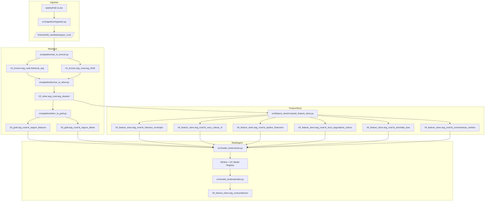

# ic-ml-model
Modelo de ML para predição de sinistro no Seguro Rural brasileiro.

## Explicação

Este projeto implementa uma solução ponta a ponta para predição de sinistro no Seguro
Rural brasileiro, com base em dados do MAPA/PSR e execução em Databricks.

O objetivo é construir um classificador binário (`flSinistro`) com rastreabilidade completa
desde a ingestão do dado bruto até a geração de score em produção.

Princípios centrais da solução:
- arquitetura medalhão (Raw → Bronze → Silver → Gold);
- features point-in-time via Feature Store;
- prevenção de leakage por separação explícita entre features e labels;
- padronização de treino e inferência com o mesmo pipeline de pré-processamento.

## Motivação

O Seguro Rural apresenta alta variabilidade por região, cultura, clima e perfil financeiro
da apólice. Um modelo preditivo de sinistro ajuda a:
- apoiar análise de risco com base em evidências históricas;
- reduzir assimetria de informação na decisão de subscrição;
- priorizar monitoramento de carteiras com maior propensão a perdas;
- fornecer base técnica para melhorias contínuas em políticas de seguro e subvenção.

## 1) Processo de Ingestão

A ingestão é dividida em duas partes:

### Download da base pública
- Arquivo: `src/ingestion/ingestion.py`
- Fontes:
	- `dados_abertos_psr_2016a2024.xlsx`
	- `dados_abertos_psr_2025.xlsx`
- Destino:
	- `/Volumes/00_raw/data/seguro_rural`

### Carga Raw → Bronze
- Arquivo: `src/pipeline/raw_to_bronze.py`
- Execução parametrizada por widgets (`table`, `tableName`)
- Tabelas resultantes:
	- `01_bronze.seg_rural.historical_seg`
	- `01_bronze.seg_rural.seg_2025`

## 2) Arquitetura Medalhão

O projeto é organizado por camadas e responsabilidades:
- `00_raw`: arquivos `.xlsx` brutos no Volume Databricks;
- `01_bronze.seg_rural.*`: ingestão sem transformação de negócio;
- `02_silver.seg_rural.seg_cleaned`: limpeza, renomeação canônica e colunas derivadas;
- `03_gold.seg_rural.*`: separação de features e labels sem leakage;
- `04_feature_store.seg_rural.*`: tabelas agregadas point-in-time para enriquecimento.

### Transformações na Silver

Arquivo principal: `src/pipeline/bronze_to_silver.py`.

Etapas relevantes:
- consolidação de histórico + ano corrente;
- tratamento de tipos, nulos e strings;
- normalização de dicionários de negócio (`tipo`, `evento`, `tipo_cultura`);
- criação de variáveis derivadas (`duracao`, `sinistro`, `sinistralidade`, `regiao`);
- remoção de colunas sensíveis e metadados não necessários.

### Publicação na Gold

Arquivo principal: `src/pipeline/silver_to_gold.py`.

Saídas:
- `03_gold.seg_rural.fs_seguro_features` (preditores)
- `03_gold.seg_rural.fs_seguro_labels` (respostas e colunas de referência)

Há validação anti-leakage para impedir colunas de desfecho no conjunto de features.

Módulos principais no repositório:
- `src/ingestion`: download e preparação dos arquivos de entrada;
- `src/pipeline`: transformação Raw → Bronze → Silver → Gold;
- `src/feature_store`: SQLs de agregação e publicação no Feature Store;
- `src/model_sinistro`: pré-processamento, treino e predição;
- `src/lib/const.py`: fonte única de constantes, tabelas e listas de colunas.

## 3) Orquestração dos Pipelines

O projeto usa Databricks Asset Bundles (DAB) em `src/jobs/`.

### Job `seg_bronze_ingestion`
- task `historical_seg`
- task `seg_2025` (dependente de `historical_seg`)

Objetivo: garantir ingestão sequencial dos dois arquivos fonte na Bronze.

### Job `seg_silver_to_gold`
- task `silver_to_gold`
- tasks dependentes para materialização de Feature Store:
	- `fs_historico_municipio`
	- `fs_risco_cultura_uf`
	- `fs_apolice_financeiro`
	- `fs_risco_seguradora_cultura`
	- `fs_anomalia_taxa`
	- `fs_concentracao_carteira`

Objetivo: consolidar Silver/Gold antes de materializar todas as tabelas de features.

## 4) Criação da Feature Store

A criação é centralizada em `src/feature_store/compute_feature_store.py`.

O notebook recebe o parâmetro `feature` e resolve:
- SQL (`src/feature_store/fs_*.sql`)
- tabela de destino (`FEATURE_MAP`)
- chave primária (`PRIMARY_KEYS`)

Tabelas materializadas:
- `04_feature_store.seg_rural.fs_historico_municipio`
- `04_feature_store.seg_rural.fs_risco_cultura_uf`
- `04_feature_store.seg_rural.fs_apolice_financeiro`
- `04_feature_store.seg_rural.fs_risco_seguradora_cultura`
- `04_feature_store.seg_rural.fs_anomalia_taxa`
- `04_feature_store.seg_rural.fs_concentracao_carteira`

Escrita feita com `mode='merge'`, mantendo execução idempotente e incremental.

## 5) Todas as features inputadas no modelo

As features estão definidas em `src/model_sinistro/preprocessing.py` e são combinadas em
`src/model_sinistro/train.py`.

### Features numéricas históricas

- `nrApolicesMun90d`, `nrSinistrosMun90d`, `nrTaxaSinistroMun90d`, `nrIndiceSeveridadeMun90d`
- `nrApolicesMun365d`, `nrSinistrosMun365d`, `nrTaxaSinistroMun365d`, `nrIndiceSeveridadeMun365d`
- `nrApolicesMun730d`, `nrSinistrosMun730d`, `nrTaxaSinistroMun730d`, `nrIndiceSeveridadeMun730d`
- `nrApolicesMun1095d`, `nrSinistrosMun1095d`, `nrTaxaSinistroMun1095d`, `nrIndiceSeveridadeMun1095d`
- `nrApolicesAbertas30d`, `nrApolicesAbertas90d`
- `nrApolicesCulturaUf365d`, `nrSinistrosCulturaUf365d`, `nrTaxaSinistroCulturaUf365d`, `nrSeveridadeCulturaUf365d`, `nrNivelCobMedioCulturaUf365d`
- `nrApolicesCulturaUf730d`, `nrSinistrosCulturaUf730d`, `nrTaxaSinistroCulturaUf730d`, `nrSeveridadeCulturaUf730d`
- `nrConcentracaoSeguradora365d`
- `nrApolicesSegCultura365d`, `nrTaxaSinistroSegCultura365d`, `nrSeveridadeSegCultura365d`
- `nrApolicesCulturaExata365d`, `nrTaxaMediaCulturaUf365d`, `nrStdTaxaCulturaUf365d`
- `nrPctCarteiraSegMun365d`, `nrHHI_seguradora_mun`
- `nrAnomaliaTaxa`

### Features numéricas de apólice

- `nrTrimestre`, `nrAnoPlantio`, `nrDuracaoDias`, `nrDuracaoRelativa`, `flSafraVerao`
- `nrDensidadeValorSegHa`, `nrPremioPorHa`, `nrRazaoCoberturaProd`
- `nrRazaoSubvencaoPremio`, `nrTaxaApolice`, `nrNivelCobertura`, `nrAreaPorAnimal`

### Features categóricas

- `tipo_cultura`, `regiao`, `seguradora`, `nrEventosDominante365d`

### Features cíclicas

- `nrSinMes`, `nrCosMes`

Observação: `mun`, `uf`, `cultura`, `apolice` e `dtRef` são chaves de lookup/rastreio,
não entradas do classificador.

## 6) train.py e predict.py

### `train.py`

Arquivo: `src/model_sinistro/train.py`.

Fluxo resumido:
- constrói âncora de treino via `src/model_sinistro/fl_sinistro.sql`;
- aplica `FeatureLookup` nas 6 tabelas de Feature Store;
- deriva atributos adicionais (`derive_features`);
- aplica corte OOT (`dtRef < 2025-01-01`) para treino/validação in-time;
- treina baselines (Decision Tree, Random Forest, AdaBoost, XGBoost);
- seleciona campeão por `auc_roc_test` e faz `GridSearchCV`;
- calcula métricas e feature importance;
- registra modelo em MLflow/Unity Catalog (`04_feature_store.seg_rural.sinistro`).

### `predict.py`

Arquivo: `src/model_sinistro/predict.py`.

Fluxo resumido:
- carrega versão do modelo do registry (`models:/...`);
- monta âncora OOT (`dtRef >= 2025-01-01`) em `02_silver.seg_rural.seg_cleaned`;
- aplica os mesmos lookups e derivações do treino;
- executa `predict_proba` e gera score + probabilidade por classe;
- persiste em `04_feature_store.seg_rural.predicoes` com estratégia idempotente.

## 7) Resultados (WIP)

Esta seção é um espaço em construção para consolidação dos experimentos.

### Métricas de avaliação (WIP)

- AUC-ROC
- AUC-PR
- KS
- F1-score
- Lift@10%

### OOT (Out-of-Time) (WIP)

- corte temporal operacional: `CUTOFF_OOT = 2025-01-01`
- treino usa `dtRef < CUTOFF_OOT`
- scoring usa `dtRef >= CUTOFF_OOT`
- serão incluídos resultados por janela temporal

### Feature importance (WIP)

- ranking das variáveis mais relevantes no campeão
- estabilidade da importância entre versões de modelo
- análise por grupos de features (histórico, apólice, categóricas)

## Melhores práticas de engenharia aplicadas no projeto

- constants centralizadas em `src/lib/const.py` (single source of truth)
- validações anti-leakage explícitas no pipeline Gold e no treino
- uso consistente de PySpark para transformação de grandes volumes
- pré-processamento unificado para treino e inferência
- jobs parametrizados e versionados via DAB
- escrita Delta com padrão idempotente para saídas de predição

## Observabilidade e Lineage usando Unity Catalog

Com tabelas e modelo registrados no Unity Catalog, o projeto favorece:
- lineage entre camadas (`01_bronze` → `02_silver` → `03_gold` → `04_feature_store`)
- governança por catálogo/schema e controle de acesso centralizado
- rastreabilidade das saídas por modelo e versão (`descModelName`, `nrModelVersion`)
- auditoria de runs de treino e inferência junto ao MLflow

## Feature Engineering no Databricks

O feature engineering combina SQL analítico + Feature Store + pré-processamento em Python:
- tabelas `fs_*.sql` calculam agregações temporais por chaves de negócio;
- `FeatureLookup` resolve joins point-in-time pela `dtRef` mensal;
- `derive_features` cria atributos de anomalia de taxa e sazonalidade cíclica;
- imputação e encoding tratam ausência de histórico e categorias novas.

## MLOps e MLflow

O fluxo de MLOps atual contempla:
- tracking de experimentos (parâmetros, métricas e artefatos)
- comparação baseline x tuning
- registro e versionamento de modelo no Unity Catalog Model Registry
- carregamento de versão específica no pipeline de predição
- persistência de outputs para consumo analítico e monitoramento futuro

## Como executar no Databricks Free Edition

Este projeto pode ser executado na Free Edition em modo notebook-first, com foco em
execução manual por etapa.

### Pré-requisitos

- conta ativa no Databricks Free Edition;
- acesso ao repositório no GitHub;
- permissões para criar notebook, schema e tabelas Delta no workspace.

### Passo 1 — Importar o projeto

Opções práticas:
- clonar via Databricks Repos (recomendado quando disponível);
- importar os arquivos `src/` manualmente para o Workspace.

Após importar, mantenha a estrutura de pastas para preservar os caminhos relativos
dos notebooks (`../lib`, `../model_sinistro`, etc.).

### Passo 2 — Preparar cluster e bibliotecas

- crie e inicie um cluster (single-node já atende para desenvolvimento);
- execute as células `%pip` existentes nos notebooks:
	- `databricks-feature-engineering`
	- `mlflow`
	- `xgboost`
	- `tqdm` / `xlrd` quando solicitado
- após instalação, reinicie o Python quando o notebook indicar `%restart_python`.

### Passo 3 — Executar pipeline de dados (ordem recomendada)

1. `src/ingestion/ingestion.py`
2. `src/pipeline/raw_to_bronze.py`
	 - rodar 2 vezes com parâmetros:
		 - `table=dados_abertos_psr_2016a2024.xlsx`, `tableName=historical_seg`
		 - `table=dados_abertos_psr_2025.xlsx`, `tableName=seg_2025`
3. `src/pipeline/bronze_to_silver.py`
4. `src/pipeline/silver_to_gold.py`
5. `src/feature_store/compute_feature_store.py`
	 - rodar para cada valor de `feature`:
		 - `fs_historico_municipio`
		 - `fs_risco_cultura_uf`
		 - `fs_apolice_financeiro`
		 - `fs_risco_seguradora_cultura`
		 - `fs_anomalia_taxa`
		 - `fs_concentracao_carteira`

### Passo 4 — Treino e inferência

1. `src/model_sinistro/train.py`
	 - gera training set, treina modelos, faz tuning e registra no MLflow/UC.
2. `src/model_sinistro/predict.py`
	 - carrega versão do modelo e grava predições em
		 `04_feature_store.seg_rural.predicoes`.

### Passo 5 — Validação rápida

Após cada etapa, valide com queries simples:
- contagem de linhas nas tabelas Bronze/Silver/Gold;
- existência das tabelas de Feature Store;
- presença de registros em `04_feature_store.seg_rural.predicoes`.

### Observações para Free Edition

- alguns recursos corporativos podem variar por plano/região (ex.: governança avançada,
	políticas de acesso e automações mais completas);
- se Workflows/DAB não estiverem disponíveis, execute integralmente em modo manual
	na ordem indicada acima;
- mantenha os nomes de catálogos/schemas/tabelas exatamente como definidos em
	`src/lib/const.py` para evitar quebra de dependências.

## Fluxograma do Projeto (Mermaid)

---

## Dicionário de Dados — Tabela Bronze (`seg_rural`)

| Coluna | Descrição |
|---|---|
| `NM_RAZAO_SOCIAL` | Razão social da seguradora |
| `CD_PROCESSO_SUSEP` | Código do produto registrado na SUSEP |
| `NR_PROPOSTA` | Número da proposta na seguradora |
| `ID_PROPOSTA` | Código identificador da proposta no sistema do MAPA (SISSER) |
| `DT_PROPOSTA` | Data da contratação da proposta |
| `DT_INICIO_VIGENCIA` | Data de início da vigência do seguro |
| `DT_FIM_VIGENCIA` | Data do fim da vigência do seguro |
| `NM_SEGURADO` | Nome do segurado |
| `NR_DOCUMENTO_SEGURADO` | Número do CPF ou CNPJ do segurado |
| `NM_MUNICIPIO_PROPRIEDADE` | Nome do município onde está localizada a propriedade |
| `SG_UF_PROPRIEDADE` | Sigla da Unidade da Federação onde está localizada a propriedade |
| `LATITUDE` | Latitude da propriedade |
| `NR_GRAU_LAT` | Grau da latitude da propriedade |
| `NR_MIN_LAT` | Minuto da latitude da propriedade |
| `NR_SEG_LAT` | Segundo da latitude da propriedade |
| `LONGITUDE` | Longitude da propriedade |
| `NR_GRAU_LONG` | Grau da longitude da propriedade |
| `NR_MIN_LONG` | Minuto da longitude da propriedade |
| `NR_SEG_LONG` | Segundo da longitude da propriedade |
| `NM_CLASSIF_PRODUTO` | Classificação do tipo de seguro |
| `NM_CULTURA_GLOBAL` | Cultura ou atividade segurada |
| `NR_AREA_TOTAL` | Área total segurada |
| `NR_ANIMAL` | Número de animais segurados |
| `NR_PRODUTIVIDADE_ESTIMADA` | Produtividade estimada |
| `NR_PRODUTIVIDADE_SEGURADA` | Produtividade segurada |
| `NivelDeCobertura` | Nível de cobertura do seguro |
| `VL_LIMITE_GARANTIA` | Valor segurado |
| `VL_PREMIO_LIQUIDO` | Valor do prêmio |
| `PE_TAXA` | Percentual da taxa de prêmio |
| `VL_SUBVENCAO_FEDERAL` | Valor da subvenção federal |
| `NR_APOLICE` | Número da apólice na seguradora |
| `DT_APOLICE` | Data de contratação da apólice |
| `ANO_APOLICE` | Ano de contratação da apólice |
| `CD_GEOCMU` | Geocódigo do município onde está localizada a propriedade |
| `VALOR_INDENIZAÇÃO` | Valor pago em indenização, em caso de sinistro |
| `EVENTO_PREPONDERANTE` | Evento preponderante causador do sinistro |

### Mapeamento Bronze → Silver

Colunas renomeadas e derivadas na camada Silver (`seg_rural.seg_cleaned`):

| Coluna Bronze | Coluna Silver | Descrição |
|---|---|---|
| `NM_RAZAO_SOCIAL` | `seguradora` | Razão social da seguradora |
| `NM_MUNICIPIO_PROPRIEDADE` | `nome_mun` | Nome do município da propriedade |
| `SG_UF_PROPRIEDADE` | `uf` | Sigla da UF da propriedade |
| `NM_CLASSIF_PRODUTO` | `tipo` | Tipo de seguro (`custeio`, `produtividade`, etc.) |
| `NM_CULTURA_GLOBAL` | `cultura` | Cultura ou atividade segurada |
| `NR_AREA_TOTAL` | `area` | Área total segurada |
| `NR_ANIMAL` | `animal` | Número de animais segurados |
| `NR_PRODUTIVIDADE_ESTIMADA` | `prod_est` | Produtividade estimada |
| `NR_PRODUTIVIDADE_SEGURADA` | `prod_seg` | Produtividade segurada |
| `NivelDeCobertura` | `nivel_cob` | Nível de cobertura do seguro |
| `VL_LIMITE_GARANTIA` | `total_seg` | Valor segurado |
| `VL_PREMIO_LIQUIDO` | `premio` | Valor do prêmio |
| `PE_TAXA` | `taxa` | Percentual da taxa de prêmio |
| `VL_SUBVENCAO_FEDERAL` | `subvencao` | Valor da subvenção federal |
| `NR_APOLICE` | `apolice` | Número da apólice |
| `CD_GEOCMU` | `mun` | Código IBGE do município |
| `VALOR_INDENIZAÇÃO` | `indenizacao` | Valor pago em indenização |
| `EVENTO_PREPONDERANTE` | `evento` | Evento causador do sinistro (normalizado) |
| *(derivada)* | `duracao` | Dias entre início e fim de vigência |
| *(derivada)* | `tipo_cultura` | Categoria da cultura (`graos`, `frutas`, etc.) |
| *(derivada)* | `sinistro` | Flag de sinistro: `0` = sem evento, `1` = com evento |
| *(derivada)* | `sinistralidade` | Razão `indenizacao / premio` |
| *(derivada)* | `regiao` | Região geográfica do Brasil |
